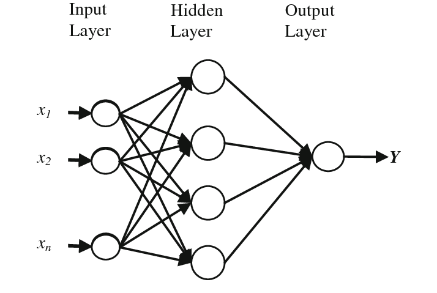

# RBF Algorithm to Time-Series Forecasting

Algorithm written in 2015 in the Scientific Initiation, on UNESPAR Campo Mourão.

Fundamental algorithm for the summary published in [**Proceeding Series of the Brazilian Society of Computational and Applied Mathematics, v. 5, n. 1, 2017**](https://proceedings.sbmac.org.br/sbmac/article/view/2085/2102), named **Aspectos Computacionais das Redes Neurais de Base Radial na Previsão de Séries Temporais**.

    

